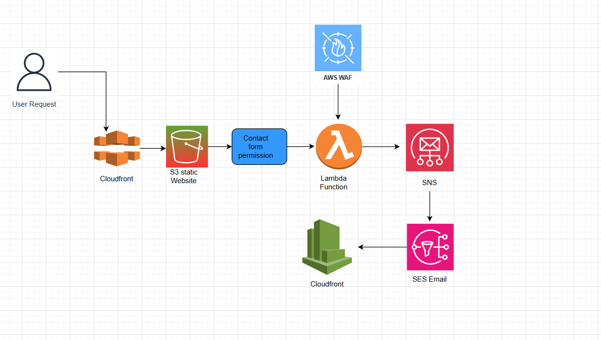

# 🏗️ AWS Serverless Contact Form System

A **production-grade serverless architecture** built for a business contact form using **AWS Lambda, SNS, SES, CloudFront, and WAF**.  
This project demonstrates end-to-end **cloud solution design, deployment, and automation** using **Terraform** and AWS managed services.

---

## 📘 Overview

This system enables secure, scalable, and cost-efficient processing of contact form submissions for an e-commerce website — without managing any servers.

Users submit messages through a static frontend hosted on **S3 + CloudFront**, which securely routes data through **AWS WAF** and **Lambda**, triggering **SNS and SES** notifications to deliver messages to the business inbox.

---

## ⚙️ Architecture Diagram

👤 User Request
↓
🌐 CloudFront (CDN + HTTPS)
↓
📋 Contact Form (Static site)
↓
🛡️ AWS WAF (Security layer)
↓
⚡ Lambda Function (Form processor)
↓
📨 Amazon SNS (Message broker)
↓
📧 Amazon SES (Email notifications)
↓
📊 CloudWatch (Logs & monitoring)

yaml
Copy code

---

## 🧩 Key AWS Components

| Service | Description |
|----------|--------------|
| **CloudFront** | Global content delivery network for static site and API access |
| **AWS WAF** | Protects from common exploits and bots |
| **Lambda** | Executes contact form logic serverlessly |
| **Amazon SNS** | Publishes processed form messages |
| **Amazon SES** | Sends verified business email notifications |
| **CloudWatch** | Logs all Lambda executions for observability |

---

## 🛠️ Technical Highlights

- **Infrastructure as Code:** All resources provisioned using Terraform  
- **Security:** IAM least-privilege roles and WAF protection  
- **Scalability:** Fully serverless, scales to zero  
- **Reliability:** Monitored via CloudWatch  
- **Cost Efficiency:** Pay only per request — ideal for low/medium traffic sites  
- **Environment Variables:** Secure configuration for SES and recipient email  

---

## 📊 Results

✅ Deployed **15+ AWS resources** with zero manual configuration  
✅ Achieved **end-to-end automation** from user input to business inbox  
✅ Reduced hosting cost by **~70%** compared to traditional servers  
✅ Enabled **global reach** via CloudFront and SES  

---

## 🧠 Skills Demonstrated

- **AWS Services:** Lambda, SNS, SES, WAF, CloudFront, CloudWatch, IAM  
- **IaC (Terraform):** Resource dependencies, roles, outputs, and modules  
- **Serverless Architecture:** Stateless, event-driven design  
- **Monitoring:** CloudWatch metrics and structured logging  
- **Security:** WAF filtering, IAM policies, SES verified identity  

---

## 🚀 Future Enhancements
 
- Integrate **DynamoDB** for lead tracking  
- Add **Cognito authentication** for admin access  
- Implement **CI/CD pipeline** with GitHub Actions

---

## PROJECT STRUCTURE

  terraform-aws-contact-form/
├── main.tf                 # Primary infrastructure
├── variables.tf            # Configuration variables
├── outputs.tf              # Terraform outputs
├── lambda/
│   └── index.js           # Contact form processor
└── README.md              # This file
